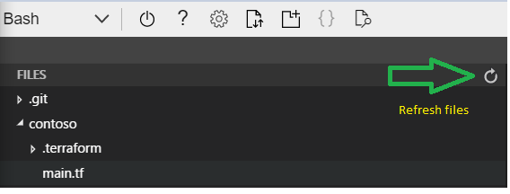

## Variable Definition Files

#### Setup

> Make sure you are in the correct folder

```bash
cd ~/clouddrive/tfw/contoso
```

## 2.1 Variables

#### Refactor `main.tf` to make it more configurable using variables

Introduce variables to `main.tf`, so it looks such as below.

* Notice how each variable has a slightly different setup. We've done this, so we can try different approaches to pass in data.

```terraform
variable prefix {}

variable region {           
    type = string
    default = "North Europe"
}

variable tags {
    type= map          
}

provider "azurerm" {
    version = "~>2.13.0"
    features {}    
}

resource "azurerm_resource_group" "contoso_rg" {
    name = "${var.prefix}_rg"
    location = var.region
    tags = var.tags
}

resource "azurerm_resource_group" "contoso_dev_rg" {    
    name = "${var.prefix}_dev_rg"
    location = var.region
    tags = var.tags
}
```

#### terraform.tfvars

From `contoso` folder, Create a file called `terraform.tfvars`

Option 1:
```bash
cd ~/clouddrive/tfw/contoso/
code terraform.tfvars
```
**or**

Option 2:
```bash
touch terraform.tfvars
code .
# and then select the file from editor's left pane
```

Add tag information to `terraform.tfvars` so it looks like below.

```terraform
# terraform.tfvars
tags = {  
    cost_center = "contoso research"    
} 
```
* Save both `main.tf` and `terraform.tf` files

> If you're using the `editor` to keep track of newly created files, make sure to hit the `refresh` button on top-right corner of the left panel to make sure it shows you the latest file structure.



#### Plan and Apply

Now, run a **`terraform plan`**. When prompted for **var.prefix**, enter "contoso"

* You should something like below, stating that there will be a force replacement.
* This is because, now our default region is set to "North Europe" and we are not passing any overrides.
* We are prompted for `prefix` because we haven't set any `default` value

```bash
  # azurerm_resource_group.contoso_rg must be replaced
-/+ resource "azurerm_resource_group" "contoso_rg" {
      ~ id       = "/subscriptions/.../resourceGroups/contoso_rg" -> (known after apply)
      ~ location = "uksouth" -> "northeurope" # forces replacement
        name     = "contoso_rg"
        tags     = {
            "cost_center" = "contoso research"
        }
    }
Plan: 2 to add, 0 to change, 2 to destroy.
```

When ready, do a **`terraform apply`** and enter "contoso" when prompted for prefix. (_and then enter `yes` when asked for approval_)

#### Verify the updates and commit your code.

This time when doing a `git add .`, you will also see `terraform.tfvars` being added.

----

## 2.2 Environment Variables and custom .tfvars

We are currently passing in the `prefix` manually from cli. Let's set an `environment variable`, so it get's picked from there.

From terminal,
```bash
export TF_VAR_prefix="contoso"
# ensure it's created correctly
env | grep TF_VAR_prefix
```

Now create two new files for .tfvars such as below, so we can make the region configurable. (this could  also be something like `.dev.tfvars`, `.prod.tfvars` in real world scenarios)

* contoso.uk.tfvars
* contoso.europe.tfvars

```bash
cd ~/clouddrive/tfw/contoso
echo 'region = "UK South"' > contoso.uk.tfvars
echo 'region = "North Europe"' > contoso.europe.tfvars
```

* Take a quick look at both `.tfvars` files and make sure they have the correct region value.

#### plan and apply

Run a plan and apply using `contoso.uk.tfvars` file

```bash
terraform plan -var-file="contoso.uk.tfvars"
terraform apply -auto-approve -var-file="contoso.uk.tfvars"
```

Notice that we are no longer prompted for `prefix` value anymore. Terraform now picks this up from the environment variable we've created.

#### Verify and commit

Verify that the resource groups are re-created in `UK South` 

Commit your code. This time when doing a `git add .`, you will also see two new `.tfvars` being added.

---

## 2.3 Variables.tf

In this step, we will move all the variable definitions to a separate file, so our config file (main.tf) looks tidy.

Create a `variables.tf` file
```
cd ~/clouddrive/tfw/contoso
code variables.tf
```

Move all the variable definitions to this file, so it looks like below.

```terraform
# variables.tf
variable prefix {}

variable region {           
    type = string
    default = "UK South"
}

variable tags {
    type= map          
}
```
* Save both `main.tf` and `variables.tf` files

#### Plan and Apply

Run a `terraform plan and apply`, but this time pass in the other `.tfvars` file (contoso.europe.tfvars), so we can force a replacement.

```bash
terraform plan -var-file="contoso.europe.tfvars"
terraform apply -auto-approve -var-file="contoso.europe.tfvars"
```

#### Verify results and Commit your code


#### Clean up the infrastructure with `terraform destroy`

* Run a `terraform destroy` and verify that both resource groups are now deleted.

* Do a `terraform show` to make sure the state file is empty.

----

## 2.4 Recap

Take a few minutes to observe and recap on different value sources that are used for our variables.

Your `contoso` folder should look like below. Make sure you are fully comfortable with what those files are. (_you can ignore state.backup file for now_)

```
contoso
|___.terraform/ 
|___contoso.europe.tfvars
|___contoso.tfplan
|___contoso.uk.tfvars
|___main.tf
|___terraform.tfstate
|___terraform.tfstate.backup
|___terraform.tfvars
|___variables.tf
```

#### Topics covered

* https://www.terraform.io/docs/configuration/variables.html
* https://www.terraform.io/docs/configuration/locals.html

See more on Environment Variables: https://www.terraform.io/docs/commands/environment-variables.html

